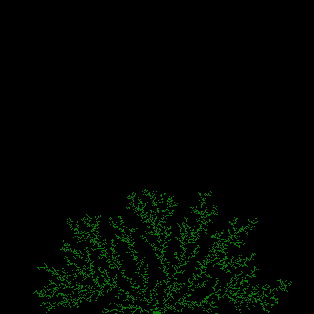

# digiplant
I'm fascinated by procedural generation processes of all sorts, from natural to crafted, from land and maps to stories to plants and more. This repository is a collection of some of my experiments with procedural generation of plant-like images.

This uses a particle deposition simulation as a base to create dendritic plant-like images. 

This is an example basic image with 10K growth points. It took about 3 minutes to generate on an older machine.

### FUTURE
* a number of command-line configurations
* supports a config file to persist growth characteristics
